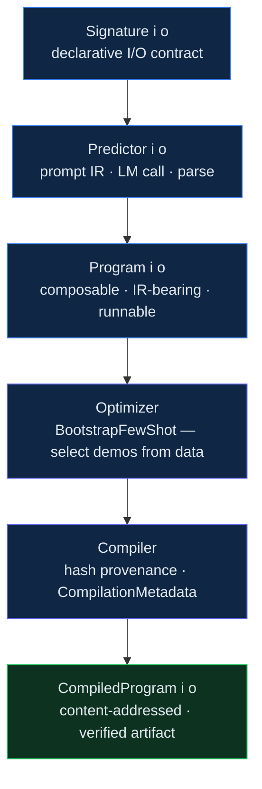
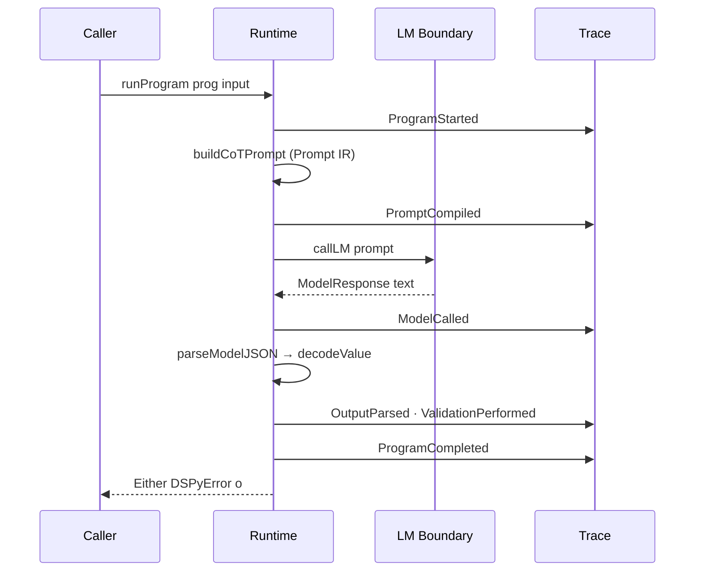
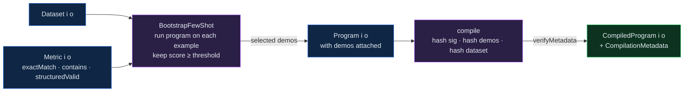

```
██████╗ ███████╗██████╗ ██╗   ██╗    ██╗  ██╗███████╗
██╔══██╗██╔════╝██╔══██╗╚██╗ ██╔╝    ██║  ██║██╔════╝
██████╔╝█████╗  ██████╔╝ ╚████╔╝     ███████║█████╗  
██╔══██╗██╔══╝  ██╔══██╗  ╚██╔╝      ██╔══██║██╔══╝  
██║  ██║███████╗██║  ██║   ██║       ██║  ██║███████╗
╚═╝  ╚═╝╚══════╝╚═╝  ╚═╝   ╚═╝       ╚═╝  ╚═╝╚══════╝

              dspy-hs — Typed, Verified DSPy in Haskell
```

# dspy-hs

Typed, Liquid Haskell–verified reimplementation of **DSPy-style declarative LLM pipelines** in Haskell.

---

## Repository layout

| Path | Contents |
|------|----------|
| `src/DSPy/` | Core library: `Core`, `Hash`, `Trace`, `Prompt`, `Example`, `Metric`, `Runtime`, `Predictor`, `Module`, `Program`, `Optimizer`, `Compiler`, `ReAct`, `Retrieve`, `Backend/Local` |
| `liquid/DSPy/` | Liquid Haskell refinement specs: `Score`, `Probability`, `Signature`, `Program` |
| `app/` | CLI entry point |
| `examples/` | End-to-end QA example with `LocalLM` |
| `test/` | Deterministic test suite (6 tests, no live LM required) |
| `dspy-hs.cabal` | Cabal package and dependency declaration |

---

## Build

```bash
cabal update
cabal build
cabal test
```

GHC 9.x + Cabal 3.x required.

---

## Verification with Liquid Haskell

```bash
liquid src/DSPy/*.hs
liquid liquid/DSPy/*.hs
```

Refinements cover:

- `Score01` — `score01` rejects values outside `[0,1]`
- `Probability` — bounded `[0,1]` type alias
- `Signature` — non-empty input and output field lists
- `Program` — non-negative demo count; non-empty dataset precondition on `compile`

---

## Architecture



Every layer produces an explicit `Trace` of observable events. No hidden chain-of-thought is consumed; reasoning is asked for as a JSON field and logged as `OutputParsed`.

---

## Runtime execution flow



---

## Optimization + compilation flow



---

## Key invariants (made unrepresentable)

- Out-of-range `Score` cannot be constructed (`score01 :: Double -> Either DSPyError Score`)
- `Program i o` applied to wrong type → compile-time error
- `CompiledProgram` requires non-empty dataset and verified metadata
- `LM` boundary is explicit — no ambient IO; all calls go through `callLM` in `Runtime`

---

## Running the example

```bash
cabal run dspy-hs -- run
# or load interactively:
cabal repl
:load examples/QA.hs
main
```

---

## License

Sovereign Leviathan Covenant. See `license`.
